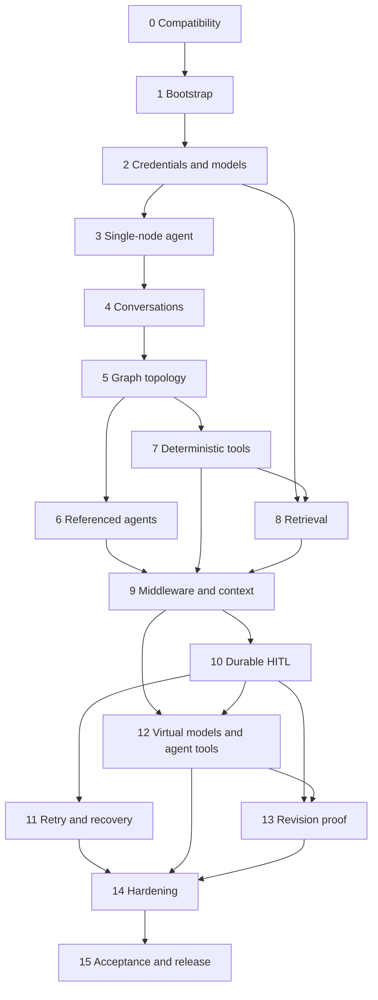

# Implementation tickets: Platform agent orchestrator

**Status:** Ready for implementation planning  
**Date:** September 16, 2026  
**Design:** [Technical design](./technical-design-agent-orchestrator.md)

These tickets deliver the complete first release through runnable vertical
slices. Dependencies are explicit. A ticket is complete only when its described
flow runs and its tests pass.

## Working rules

Each ticket must follow these rules:

- Pin exact dependency versions and commit both lockfiles.
- Keep LangChain and LangGraph behind only the four approved seams.
- Use PostgreSQL integration tests for durable behavior.
- Use fake models and local deterministic tools in automated tests.
- Add no background worker, Redis, authentication, or expression language.
- Keep every revision immutable after publication.
- Preserve native LangGraph stream payloads.

## Ticket 0: Prove framework compatibility

Prove the required framework behavior before building product abstractions.

**Depends on:** Nothing.

**Deliverables:**

- Initialize Python 3.12 with `uv` and a minimal test suite.
- Pin compatible LangChain, LangGraph, PostgreSQL checkpointer, LiteLLM, FastAPI,
  and Pydantic versions.
- Add focused executable spikes for `create_agent()`, structured output,
  middleware order, retry, timeout, `@task`, subgraph interrupts,
  `Command(resume=...)`, and native subgraph streaming.
- Start `pgvector` PostgreSQL through Docker Compose.
- Run checkpointer setup through an explicit command.
- Record any API adaptation inside the approved seams.

**Acceptance:** One test interrupts a subgraph, closes its checkpointer/process
context, recreates the graph, resumes with the same `thread_id`, and completes.
Another test proves a completed task isn't rerun after node retry.

## Ticket 1: Bootstrap the local application

Create the smallest local backend and frontend with one root command.

**Depends on:** Ticket 0.

**Deliverables:**

- Create the agreed repository layout.
- Add FastAPI health and readiness endpoints bound to `127.0.0.1`.
- Create React, TypeScript, and Vite using Bun.
- Add a root Bun script that starts backend and frontend development processes.
- Add SQLAlchemy async setup, Alembic, configuration loading, and structured
  logging with payloads disabled.
- Add CI-equivalent scripts for formatting, linting, typing, and tests.

**Acceptance:** `bun run dev` starts both applications against PostgreSQL, and
the browser renders backend health without external network access.

## Ticket 2: Store encrypted credentials and model revisions

Deliver a model catalog whose secrets never leave the resolver boundary.

**Depends on:** Ticket 1.

**Deliverables:**

- Migrate `credentials`, `models`, and `model_revisions`.
- Implement AES-256-GCM storage with authenticated metadata.
- Add credential create, replace, list metadata, and disable APIs.
- Add model identity, revision, list, and detail APIs.
- Implement `ChatLiteLLM` model resolution with optional base URL.
- Add fake model resolution for tests.
- Add UI forms for credentials and model revisions.

**Acceptance:** A model revision resolves to a chat model object. API responses,
logs, exceptions, and database query snapshots outside the credential row don't
contain the plaintext secret.

## Ticket 3: Publish and run a single-node agent

Deliver the first end-to-end agent as immutable data.

**Depends on:** Ticket 2.

**Deliverables:**

- Migrate `agents`, `agent_drafts`, `agent_revisions`, dependencies, and `runs`.
- Implement strict versioned revision models and canonical content hashes.
- Implement autosave validation and publish validation for one inline node.
- Add immutability triggers and transactional publication.
- Implement the revision repository and single-node compiler using
  `create_agent()`.
- Implement orchestration run creation and a minimal SSE encoder.
- Add an editor for metadata, prompt, schemas, model selection, validate, and
  publish.
- Add a run panel that renders native token chunks and terminal output.

**Acceptance:** A user creates, validates, publishes, and runs one agent from the
UI. The run uses the published revision and returns a named result through SSE.

## Ticket 4: Persist conversations across restarts

Add durable multi-turn conversation mode and rebuildable message projections.

**Depends on:** Ticket 3.

**Deliverables:**

- Migrate `conversations` and `messages`.
- Integrate `PostgresSaver` with `thread_id = conversation_id`.
- Add conversation creation, message streaming, detail, and history APIs.
- Project native messages idempotently into the messages table.
- Add a projection rebuild command from checkpoints.
- Add conversation UI with pinned revision information.

**Acceptance:** The second turn remembers the first. Restarting FastAPI between
turns preserves memory. Runtime continuation reads checkpoints, not `messages`.

## Ticket 5: Add graph topology and validation

Compile direct edges, branches, joins, loops, routing, and named exits.

**Depends on:** Ticket 4.

**Deliverables:**

- Implement universal runtime state and conflict-safe output reducers.
- Parse and validate direct, exit, semantic, mechanical, and `join: all` edges.
- Validate reachability, exit paths, route coverage, mappings, cycle exits, and
  recursion limits.
- Compile fan-out, fan-in, conditional edges, loops, and terminal results.
- Add React Flow canvas and edge configurators.
- Map JSON Pointer diagnostics to canvas nodes and fields.

**Acceptance:** A graph fans out to two inline agents, waits for both, routes on
an enum, and returns the expected named result. A loop without a conditional
exit is rejected at publish.

## Ticket 6: Add referenced sub-agents

Deliver private-state, inspectable subgraphs pinned transitively at publish.

**Depends on:** Ticket 5.

**Deliverables:**

- Implement agent node `ref` input mapping and named-result output mapping.
- Resolve and store transitive revision dependencies.
- Detect transitive `ref` cycles.
- Compile referenced revisions bottom-up with private state.
- Preserve subgraph namespaces with `subgraphs=True`.
- Add referenced-agent selection and mapping UI.

**Acceptance:** Two referenced agents run in parallel, expose distinct native
namespaces, keep private messages out of parent state, join, and complete.
Publishing A referencing B referencing A fails with a path-addressed diagnostic.

## Ticket 7: Add deterministic tools

Deliver code, HTTP, and MCP tools plus deterministic tool nodes.

**Depends on:** Ticket 5.

**Deliverables:**

- Migrate `tools` and `tool_revisions`.
- Implement the exact-version code tool registry.
- Implement HTTP JSON tools with schema validation, timeout, credential headers,
  idempotency keys, and DNS-aware SSRF protection.
- Implement Streamable HTTP MCP tool resolution with the same network policy.
- Implement tool node field mapping.
- Wrap each invocation in one generic deterministic `@task` adapter.
- Add tool catalog, revision, mapping, and risk configuration UI.

**Acceptance:** A deterministic tool node maps upstream output to tool input and
returns validated output. A transient tool can retry without replaying a
completed task. Private and metadata-service targets are rejected unless an
exact local allowlist permits them.

## Ticket 8: Add retrieval

Deliver bounded manual knowledge ingestion and retrieval without a pipeline.

**Depends on:** Tickets 2 and 7.

**Deliverables:**

- Enable `pgvector` and migrate knowledge bases, documents, and chunks.
- Add bounded synchronous text ingestion, chunking, embedding, list, and delete
  APIs.
- Implement retrieval tool revisions and cosine search with a maximum `top_k`.
- Mark retrieved text as untrusted in prompt assembly.
- Add minimal knowledge base and document UI.

**Acceptance:** A user uploads text, publishes an agent with the retrieval tool,
and receives relevant chunks. Tests use a deterministic embedding model and no
external network.

## Ticket 9: Add middleware and context policy

Deliver limits, retry, sanitization, summarization, context editing, tool
selection, PII, and dynamic upstream context.

**Depends on:** Tickets 6, 7, and 8.

**Deliverables:**

- Implement the compiler-owned middleware order.
- Add model and tool call limits.
- Add model retry and sanitizing tool error behavior.
- Add upstream and retrieval prompt context with strict size limits.
- Add summarization at the configured relative or absolute threshold.
- Add context editing and optional PII handling.
- Add optional large-tool-set selection.
- Add middleware capability controls to the editor.

**Acceptance:** Observable tests prove middleware order, raw external errors
never reach the model or stream, upstream context includes only allowed nodes,
and long conversations summarize without splitting paired tool messages.

## Ticket 10: Add durable HITL

Deliver tool approval and node output review across process restarts.

**Depends on:** Ticket 9.

**Deliverables:**

- Migrate `run_interrupts` as an idempotent projection.
- Add risky-tool approval with approve, edit, and reject decisions.
- Add node review with accept, revise, and abort decisions.
- Validate edited input and revised output against pinned schemas.
- Implement the resume endpoint with row locking and duplicate protection.
- Add pending interrupt controls to run and conversation views.

**Acceptance:** A risky tool interrupts before execution. After FastAPI restarts,
approval resumes the same run, executes the tool once, and doesn't rerun upstream
nodes. Duplicate resume returns `409`. Invalid edits leave the run interrupted.

## Ticket 11: Add retry, cancellation, and recovery

Complete request-bound execution behavior and operational recovery.

**Depends on:** Ticket 10.

**Deliverables:**

- Apply classified native node retry with exponential backoff and jitter.
- Apply native async run and idle timeouts.
- Mark disconnected request invocations `cancelled` after cancellation.
- Implement retry with input `None` for failed and cancelled runs.
- Preserve failed-attempt write isolation and completed upstream checkpoints.
- Add safe failure codes and the full failure matrix behavior.
- Add retry controls and status rendering to the UI.

**Acceptance:** Disconnect a run after an upstream node completes, then retry.
The run continues from its checkpoint and doesn't rerun that node. Permanent
errors aren't retried, and timeout errors are sanitized.

## Ticket 12: Add virtual models and agent-as-tool

Complete dynamic model routing and LLM-selected sub-agent invocation.

**Depends on:** Tickets 9 and 10.

**Deliverables:**

- Implement virtual model revisions with pinned underlying revisions.
- Resolve fallback and round-robin models through `ChatLiteLLMRouter`.
- Expose an agent revision as a model-callable tool with fresh invocation state.
- Detect transitive HITL and reject unsafe agent-as-tool publication.
- Add virtual model and agent-tool selection UI.

**Acceptance:** A virtual model falls back under a simulated transient failure.
An agent-as-tool can be called repeatedly with isolated state. Any transitive
HITL dependency produces the required publish diagnostic.

## Ticket 13: Add conversation upgrades and revision proof

Complete explicit upgrades while preserving old run behavior.

**Depends on:** Tickets 10 and 12.

**Deliverables:**

- Add conversation upgrade with summary and a new thread.
- Display pinned revisions in conversation and run views.
- Prevent all revision deletion while referenced.
- Add process cache eviction tests and revision-tree hash verification.

**Acceptance:** Pause a run, publish a changed dependency tree, restart the
server, and resume. The old run uses the old tree. A new run uses the new tree.
Upgrading a conversation creates a separate thread with its summary.

## Ticket 14: Harden streaming, security, and observability

Apply one redaction boundary across streams, projections, logs, and errors.

**Depends on:** Tickets 11, 12, and 13.

**Deliverables:**

- Complete JSON-safe encoding for all native chunk types.
- Preserve subgraph namespace and LangGraph metadata.
- Add structured run, node, task, usage, interrupt, and safe error logging.
- Aggregate usage without treating missing metadata as zero.
- Add CORS and local binding checks.
- Add credential canary tests across logs, checkpoints, streams, and projections.
- Add optional LangSmith environment integration.

**Acceptance:** A canary credential never appears outside its encrypted row or
resolver memory. Native message, update, custom, subgraph, tool, and interrupt
chunks all encode and render without a parallel event taxonomy.

## Ticket 15: Complete acceptance UI and release gates

Close all product flows and document local operation.

**Depends on:** Ticket 14.

**Deliverables:**

- Finish editor forms, canvas states, validation panel, catalogs, and publish
  flow.
- Finish run viewer, conversation view, HITL controls, retry, named results, and
  usage rendering.
- Add loading, empty, cancelled, interrupted, failed, and schema-error states.
- Meet keyboard navigation, focus visibility, labels, and contrast requirements.
- Add the seven end-to-end acceptance flows from the technical design.
- Add local setup, migration, checkpointer setup, development, test, and manual
  provider smoke-test documentation.

**Acceptance:** Every PRD acceptance scenario passes against PostgreSQL. The
application starts from a clean checkout using documented commands and binds
only to localhost.

## Release dependency graph

The implementation order contains limited safe parallelism.

Tickets 6 and 7 can run in parallel after ticket 5. UI work inside a ticket can
run in parallel with backend work only after its API contract is fixed.

## Definition of done

Every ticket must meet the same completion bar:

1. Apply and roll back its migrations on a clean PostgreSQL database.
2. Pass targeted unit and integration tests.
3. Pass backend formatting, linting, and type checks.
4. Pass frontend formatting, linting, type checks, and tests.
5. Exercise the ticket's acceptance flow through its public API or UI.
6. Keep secrets and unsafe external errors out of observable output.
7. Update technical documentation when the implemented contract changes.

A schema-only or abstraction-only change doesn't complete a ticket. Each ticket
must leave one runnable product path.
